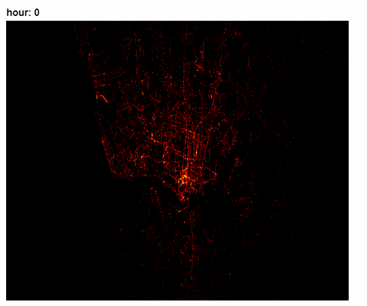

# Taxi Service Trajectory (TST) Prediction Challenge

O dataset contém informações sobre a trajetória de milhares de táxis durante um ano na cidade de Porto. Será que é possível prever para onde um passageiro vai?

## Análise exploratória

Algumas informações interessantes foram extraídas daqui. Sabia que um taxista anda, em média, 52 mil km por ano? oO

https://github.com/marcoayamada/porto_taxis/blob/master/EDA.ipynb

## Transformações e conversões

Esse notebook possui a maioria das conversões e tratamentos que foram feitos nos dados.

https://github.com/marcoayamada/porto_taxis/blob/master/Transformations.ipynb

## Prevendo o local de chegada

É possível prever onde o taxista deixará o cliente com base nos dados coletados durante um ano? Confira aqui:

https://github.com/marcoayamada/porto_taxis/blob/master/ml.ipynb

___

## Melhorias

Esse foi um desafio de 2015 que tinha 2 objetivos: prever o local de chegada dos passageiros e a duração da viagem. Até o momento foi realizada a previsão do local apenas.

> Mais informações:  
> http://www.geolink.pt/ecmlpkdd2015-challenge/index.html  
> https://archive.ics.uci.edu/ml/datasets/Taxi+Service+Trajectory+-+Prediction+Challenge%2C+ECML+PKDD+2015
